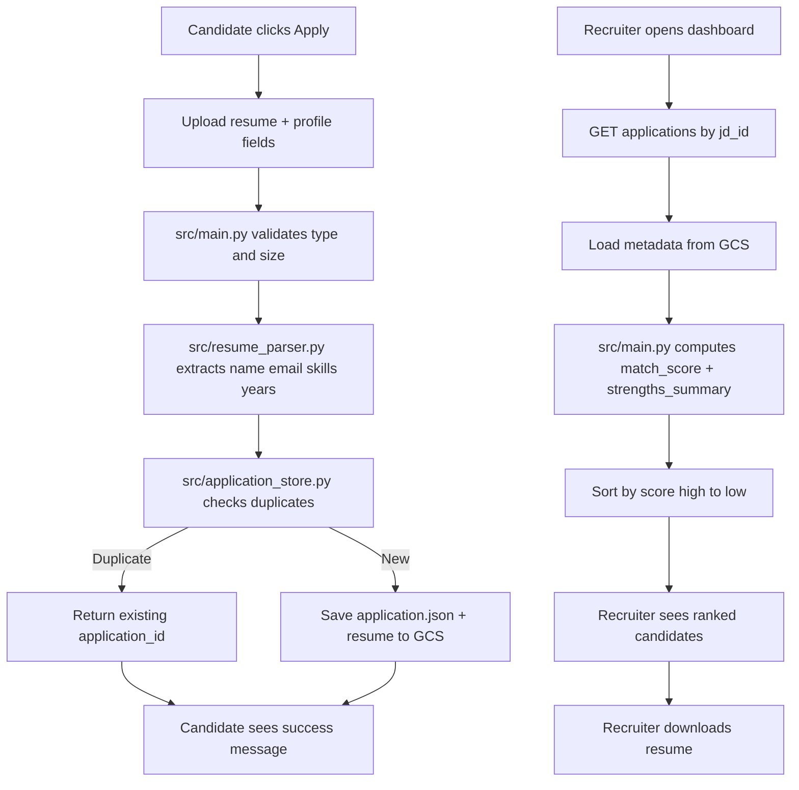

# Globe Telecom JD + Hiring Demo (Google Cloud)

## Executive Summary (<=500 chars)
This demo turns natural language into a full hiring workflow: Gemini generates JDs, GCS stores and serves them, candidates apply with resumes, the backend parses and ranks applicants, and recruiters review results in one dashboard. Each capability maps to clear files in `src/`. Google Cloud AI is the engine that creates high-quality JD content, grounded by company references from GCS, making the system practical, fast to iterate, and enterprise-ready.

## Who This Guide Is For
This README is written for beginners. You do not need a deep software background to understand:
- what each file does
- how files work together
- which files implement each feature
- why Google Cloud AI is essential in this demo

## 1. What The Product Does
At a business level, this system provides four outcomes:
1. Create JD drafts quickly from plain language.
2. Publish JDs to a public gallery for candidates.
3. Accept and parse resumes automatically.
4. Rank and summarize candidates for recruiters.

## 2. Big Picture Architecture
```text
Browser (Chat / Gallery / Recruiter)
  -> FastAPI App (src/main.py)
    -> Gemini Generation (src/chat_agent.py, src/jd_agent.py)
    -> Reference Context from GCS (src/reference_store.py)
    -> JD Storage (src/jd_store.py)
    -> Application + Resume Storage (src/application_store.py)
    -> Resume Parsing (src/resume_parser.py)
  -> Google Cloud Services (Vertex AI + Cloud Storage)
```

### Visual Flow (Read This First)
```mermaid
flowchart LR
    U1[Hiring Manager - Chat Page] -->|POST /chat or /generate| API[FastAPI - src/main.py]
    U2[Candidate - Gallery Page] -->|POST /api/jds/{jd_id}/apply| API
    U3[Recruiter - Recruiter Page] -->|GET /api/jds/{jd_id}/applications| API

    API --> TMP[Load Template - src/template_store.py]
    API --> REF[Load References - src/reference_store.py]
    TMP --> LLM[Gemini on Vertex AI]
    REF --> LLM
    LLM --> JD[JD Markdown]
    JD --> JDSTORE[Store JD in GCS - src/jd_store.py]
    JDSTORE --> GCS1[(GCS Bucket jackytest007)]
    GCS1 --> GALLERY[Gallery Listing]

    API --> PARSE[Parse Resume - src/resume_parser.py]
    API --> APPSTORE[Save/List Application - src/application_store.py]
    PARSE --> APPSTORE
    APPSTORE --> GCS2[(GCS Bucket jackytest008)]
    GCS2 --> RANK[Score + Summary in src/main.py]
    RANK --> DASH[Recruiter Dashboard View]
```

### Application + Recruiter Detail Flow


### Diagram Legend
- Left side is user action, middle is backend orchestration, right side is cloud storage/output.
- `src/main.py` is the controller that connects all modules.
- Vertex AI Gemini is the only generation engine for JD text.
- GCS uses two logical areas: JDs (`jackytest007`) and applications (`jackytest008`).

## 3. File Purpose (Beginner-Friendly)

### Core backend
- `src/main.py`
  - Main controller. Defines API routes, validates requests, combines all modules.
  - Think of this as the "traffic police".
- `src/chat_agent.py`
  - Conversational JD generation using Gemini (multi-turn chat).
- `src/jd_agent.py`
  - Structured JD generation API path (`/generate`) for programmatic usage.
- `src/reference_store.py`
  - Reads company reference docs from GCS and builds prompt context.
- `src/jd_store.py`
  - Saves JD markdown files and metadata index to GCS.
- `src/application_store.py`
  - Saves applications/resumes to GCS, lists submissions, downloads resumes.
  - Includes duplicate detection by resume fingerprint and email.
- `src/resume_parser.py`
  - Extracts key resume fields: name, email, phone, title, years, skills, summary.
- `src/config.py`
  - Loads environment variables (project, region, model, bucket names).
- `src/template_store.py`
  - Loads JD template markdown from `templates/`.

### Frontend pages
- `src/chat.html`
  - Chat interface for JD generation.
- `src/gallery.html`
  - Public JD listing/detail page + Apply button and upload modal.
- `src/recruiter.html`
  - Recruiter dashboard for ranked candidate review.

### Supporting files
- `templates/globe_telecom_default.md`
  - JD output structure and section format.
- `.env.example`
  - Runtime config template.
- `requirements.txt`
  - Python dependencies.
- `IMPLEMENTATION.md`
  - Deep technical implementation notes.
- `FEATURES.md`
  - Feature snapshot.

## 4. How Files Interact (Step By Step)

### A) JD generation flow (`POST /chat`)
1. `src/main.py` receives user message.
2. `src/reference_store.py` loads reference text from GCS.
3. `src/template_store.py` loads JD template.
4. `src/chat_agent.py` sends combined prompt to Gemini.
5. `src/jd_store.py` stores generated JD to GCS.
6. `src/main.py` returns response to UI.

### B) Candidate apply flow (`POST /api/jds/{jd_id}/apply`)
1. `src/main.py` validates file type and size.
2. `src/resume_parser.py` extracts resume signals.
3. `src/application_store.py` checks duplicates.
4. If duplicate: return existing application ID.
5. If new: save metadata + resume to GCS.

### C) Recruiter list flow (`GET /api/jds/{jd_id}/applications`)
1. `src/application_store.py` loads application metadata.
2. `src/main.py` computes `match_score` and `strengths_summary`.
3. Results are sorted and shown in `src/recruiter.html`.

## 5. Feature-to-File Mapping

- Chat JD generation
  - `src/main.py`, `src/chat_agent.py`, `src/template_store.py`, `src/reference_store.py`
- Structured JD API
  - `src/main.py`, `src/jd_agent.py`
- JD persistence and gallery
  - `src/main.py`, `src/jd_store.py`, `src/gallery.html`
- Resume apply/upload
  - `src/main.py`, `src/gallery.html`, `src/application_store.py`
- Resume parsing
  - `src/main.py`, `src/resume_parser.py`
- Recruiter ranking and strengths summary
  - `src/main.py`, `src/recruiter.html`
- Deduplication
  - `src/main.py`, `src/application_store.py`

## 6. Exactly Where Google Cloud AI Is Used

### Vertex AI Gemini (generation engine)
- `src/chat_agent.py`
  - `ChatAgent.reply()` calls `genai.Client().models.generate_content(...)`.
- `src/jd_agent.py`
  - `JDAgent.generate()` calls `genai.Client().models.generate_content(...)`.

### Why this is important
Without Gemini, this system cannot produce high-quality, context-aware JD text in real time. You would only have static templates and manual editing.

## 7. Why Google Cloud AI Is Non-Negotiable In This Demo
Google Cloud AI is not a "nice-to-have" here. It is the core differentiator:
1. Language intelligence: turns rough intent into production-ready JD text.
2. Context grounding: uses company references from GCS to align style and standards.
3. Speed: enables rapid drafting and iteration in chat.
4. Enterprise deployment path: works with GCP identity, region controls, and cloud storage.

If you remove Google Cloud AI, the demo becomes a basic form app, not an intelligent hiring assistant.

## 8. Storage Model (GCS)

### JD bucket (example)
```text
gs://jackytest007/generated-jds/
  .index.json
  jd-<id>.md
```

### Application bucket (example)
```text
gs://jackytest008/job-applications/<jd_id>/<date>/<application_id>_<slug>/
  application.json
  <resume_file>
```

## 9. API Index
- `GET /`
- `GET /gallery`
- `GET /recruiter`
- `POST /chat`
- `POST /generate`
- `GET /api/jds`
- `GET /api/jds/{jd_id}`
- `POST /api/jds/{jd_id}/apply`
- `GET /api/jds/{jd_id}/applications`
- `GET /api/applications`
- `GET /api/jds/{jd_id}/applications/{application_id}/resume`
- `GET /health`

## 10. Quick Start
```bash
cd jd-agent-gcp
python3 -m venv .venv
source .venv/bin/activate
pip install -r requirements.txt

gcloud auth application-default login

export PYTHONPATH=$PWD:$PYTHONPATH
export GOOGLE_CLOUD_PROJECT=demo0908
export GOOGLE_CLOUD_LOCATION=us-central1
export GOOGLE_GENAI_USE_VERTEXAI=true
export MODEL_NAME=gemini-2.5-pro
export TEMPLATE_DIR=templates
export REFERENCE_BUCKET=jackytest007
export APPLICATION_BUCKET=jackytest008
export APPLICATION_PREFIX=job-applications
export REFERENCE_ENABLED=true

uvicorn src.main:app --host 127.0.0.1 --port 8080
```

Open:
- Chat: `http://127.0.0.1:8080/`
- Gallery: `http://127.0.0.1:8080/gallery`
- Recruiter: `http://127.0.0.1:8080/recruiter`
